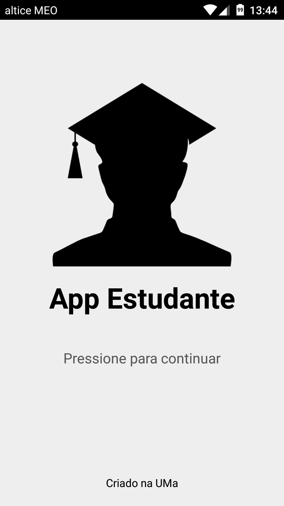
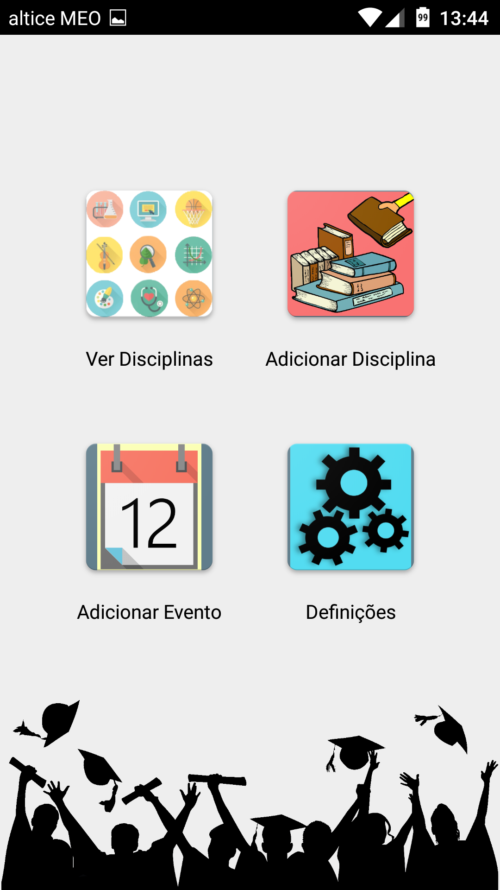
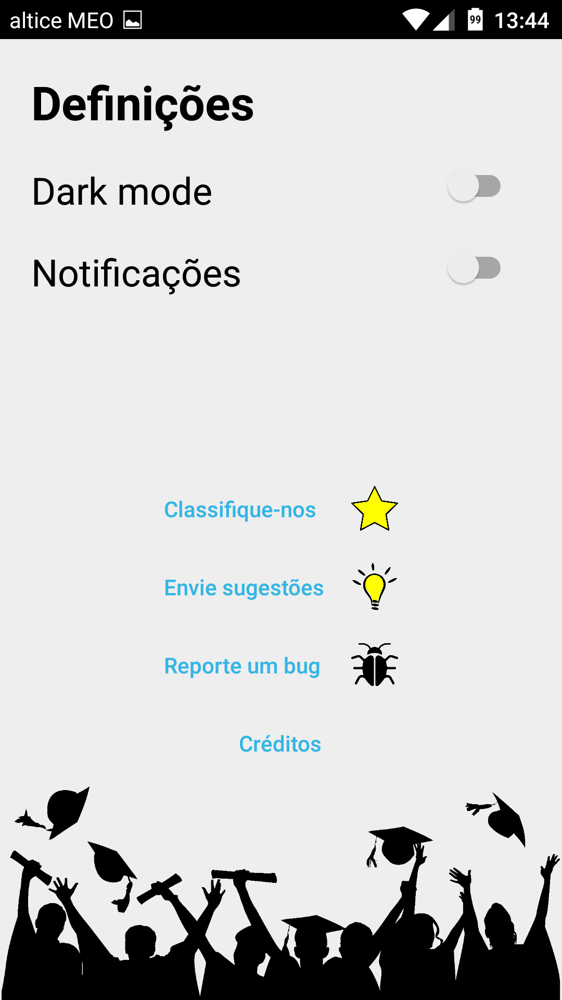
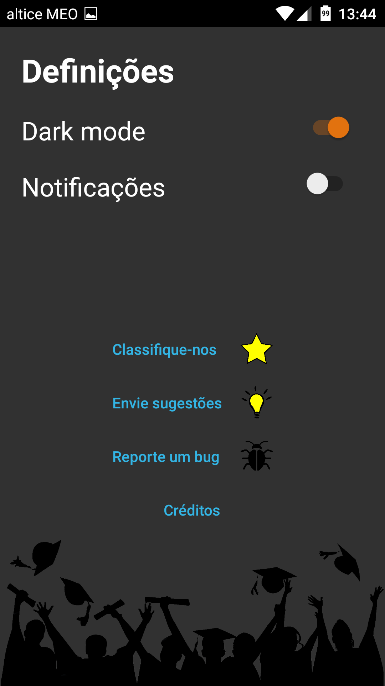
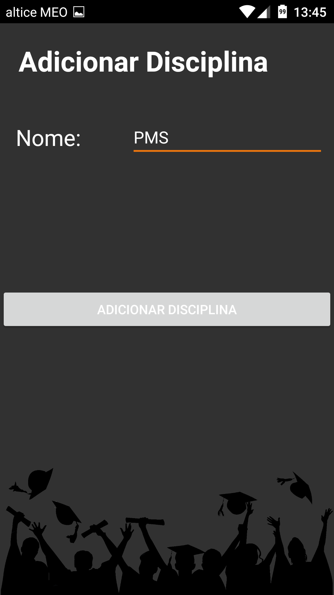
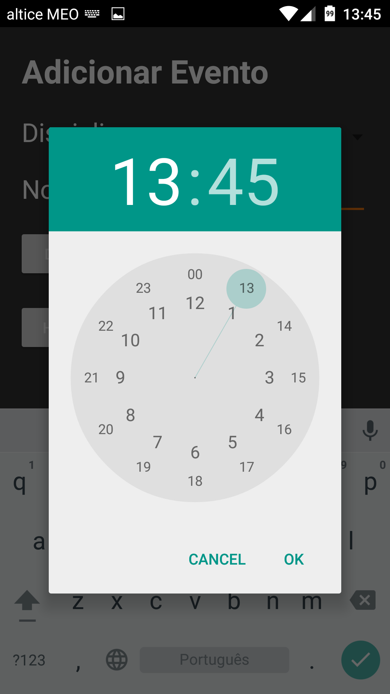
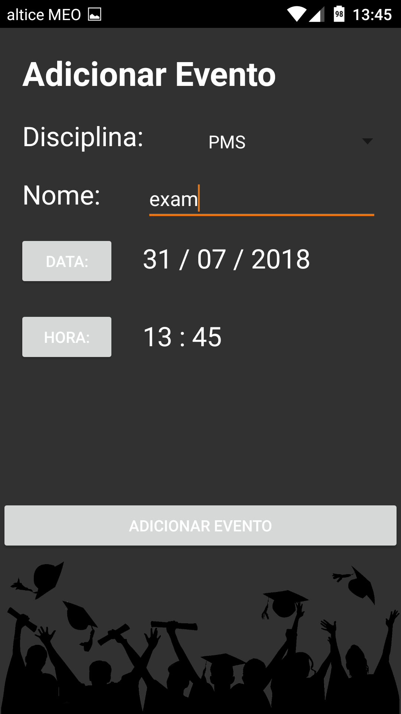
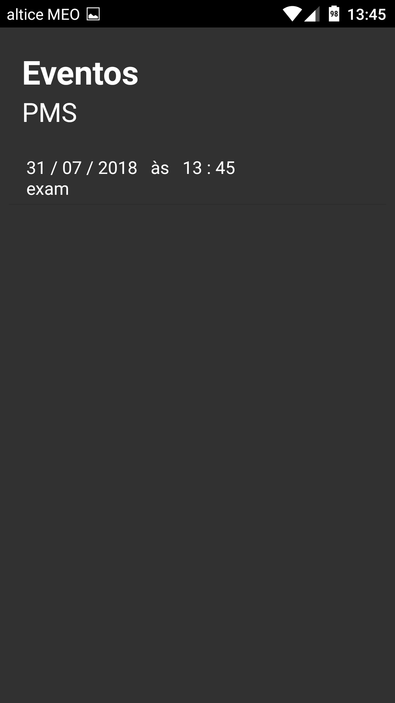

# AppEstudante
First Android application for a university assignment. Made with Android Studio.  
Simple app for students that allows them to keep track of upcoming events such as exams, keep a list of tasks, and be notified about upcoming events.  
  

## Screenshots:  

  
  
  
  
  
  
  
  

